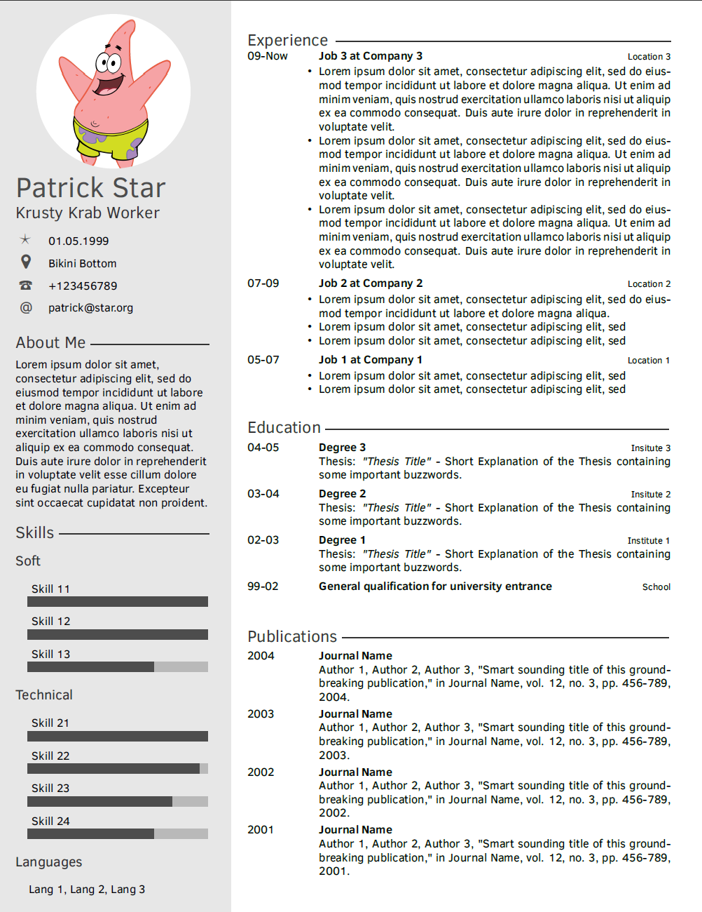

# Superstar CV Template

superstar-cv-template-latex is just what it sounds like. A LaTeX template for a resume / curriculum vitae. It strictly separates the content from the structural template. In addition to the resume page you can showcase your certificates in a visually consistent manner.



 You can include your own content by either editing the content-dummy.tex or by creating your own content.tex file that you input in the main.tex instead of: 

```
\input{cv-content-dummy/content-dummy.tex}
```

## Credit Where Credit Is Due:
This template is derived from the 
"Twenty Seconds Resume/CV Version 1.1 (8/1/17)" 
which can be found here: 
https://github.com/spagnuolocarmine/TwentySecondsCurriculumVitae-LaTex 
or here:
http://www.LaTeXTemplates.com.
The Twenty Seconds Resume/CV was created by 
Carmine Spagnuolo (cspagnuolo@unisa.it) and 
Vel (vel@LaTeXTemplates.com)